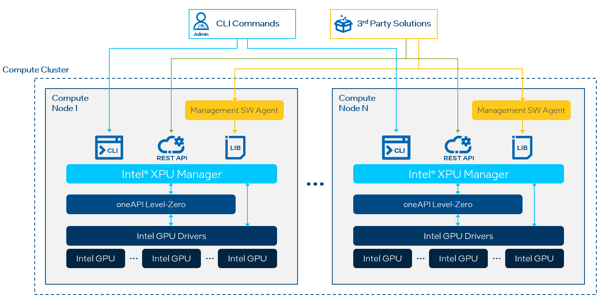

# Intel(R) XPU Manager and XPU System Management Interface
Intel(R) XPU Manager is a free and open-source tool for monitoring and managing Intel data center GPUs.

It is designed to simplify administration, maximize reliability and uptime, and improve utilization.

XPU Manager can be used standalone through its command line interface (CLI) to manage GPUs locally, or through its RESTful APIs to manage GPUs remotely. Intel(R) XPU System Management Interface (XPU-SMI) is the daemon-less version of XPU Manager and it only provides the local interface. XPU-SMI feature scope is the subset of XPU Manager. Their features are listed in the table below. 

amcmcli is a portable CLI tool to manage GPU AMC firmware on Linux OS. It is independent of GPU driver. 

3rd party open-source and commercial workload and cluster managers, job schedulers, and monitoring solutions can also integrate the XPU Manager or XPU-SMI to manage Intel data center GPUs.

## Intel(R) XPU Manager features
* Administration:
	* GPU discovery and information - name, model, serial, stepping, location, frequency, memory capacity, firmware version
	* GPU topology and grouping
	* GPU Firmware updating, including GPU GFX firmware and AMC (Add-in card Management Controller) firmware updating. 
* Monitoring:
	* GPU telemetry – utilization, power, frequency, temperature, fabric speed, memory throughput, errors
	* GPU health – memory, power, temperature, fabric port, etc.
* Diagnostics:
	* 3 levels of GPU diagnostic tests
	* Pre-check GPU hardware and driver critical issues
	* GPU log collection for the issue investigation
* Configuration:
	* GPU Settings - GPU power limits, frequency range, standby mode, scheduler mode, ECC On/Off, performance factor, fabric port status
	* GPU policies - Throttle GPU when the temperature set threshold is reached 
* Supported Frameworks:
	* Prometheus exporter, Docker container support, Icinga plugin
 
## CLI output of GPU device info, telemetries and firmware update
```
xpumcli discovery -d 0
+-----------+--------------------------------------------------------------------------------------+
| Device ID | Device Information                                                                   |
+-----------+--------------------------------------------------------------------------------------+
| 0         | Device Type: GPU                                                                     |
|           | Device Name: Intel(R) Graphics [0x56c0]                                              |
|           | Vendor Name: Intel(R) Corporation                                                    |
|           | UUID: 01000000-0000-0000-0000-0000004d0000                                           |
|           | Serial Number: LQAC20305316                                                          |
|           | Core Clock Rate: 2050 MHz                                                            |
|           | Stepping: C0                                                                         |
|           |                                                                                      |
|           | Driver Version:                                                                      |
|           | Kernel Version: 5.15.47+prerelease3762                                               |
|           | GFX Firmware Name: GFX                                                               |
|           | GFX Firmware Version: DG02_1.3170                                                    |
|           | GFX Data Firmware Name: GFX_DATA                                                     |
|           | GFX Data Firmware Version: 0x12d                                                     |
|           |                                                                                      |
|           | PCI BDF Address: 0000:4d:00.0                                                        |
|           | PCI Slot: J37 - Riser 1, Slot 1                                                      |
|           | PCIe Generation: 4                                                                   |
|           | PCIe Max Link Width: 16                                                              |
+-----------+--------------------------------------------------------------------------------------+

xpumcli dump -d 0 -m 0,1,2,3
Timestamp, DeviceId, GPU Utilization (%), GPU Power (W), GPU Frequency (MHz), GPU Core Temperature (Celsius Degree)
21:23:00.000,    0, 99.55, 119.61, 1800, 49.00
21:23:01.000,    0, 99.45, 119.36, 1800, 50.00
21:23:02.000,    0, 99.48, 119.55, 1750, 50.50
21:23:03.000,    0, 99.65, 119.24, 1700, 51.00


sudo xpumcli updatefw -d 0 -t GFX -f ATS_M150_512_C0_PVT_ES_032_gfx_fwupdate_SOC1.bin
Device 0 FW version: DG02_1.3170
Image FW version: DG02_1.3172
Do you want to continue? (y/n) y
Start to update firmware
Firmware Name: GFX
Image path: /home/dcm/ATS_M150_512_C0_PVT_ES_032_gfx_fwupdate_SOC1.bin
[============================================================] 100 %
Update firmware successfully.
```

 
## Feature set of XPU Manager, XPU-SMI and Windows CLI tool
|                           | XPU Manager            | XPU-SMI              | Windows CLI tool             | amcmcli         |
| :------------------------ | :--------------------: | :------------------: | :--------------------------: | :-------------: |
| Device Info and Topology  | Yes                    | Yes                  | Yes                          | No              |
| GPU Telemetries           | Yes (aggregated data)  | Yes (real-time data) | Yes (real-time data)         | No              |
| GPU Firmware Update       | GFX, GFX_Data, AMC     | GFX, GFX_Data        | GFX, GFX_Data                | AMC             |
| GPU Configuration         | Yes                    | Yes                  | Yes                          | No              |
| GPU Diagnostics           | Yes                    | Yes                  | No                           | No              |
| GPU Health                | Yes                    | No                   | No                           | No              |
| GPU Grouping              | Yes                    | No                   | No                           | No              |
| GPU policy                | Yes                    | No                   | No                           | No              |
| Architecture              | Daemon based           | Daemon-less          | Daemon-less                  | Daemon-less     |
| Interfaces                | CLI, RESTFul, Library  | CLI, Library         | CLI                          | CLI             |

## How to get XPU Manager, XPU-SMI, Windows CLI and amcmcli binaries. 
You may get the latest installers or binaries in [Releases](https://github.com/intel/xpumanager/releases).

## Supported Devices
* Intel(R) Data Center Flex Series GPU ([GPU Driver Installation Guides](https://dgpu-docs.intel.com/installation-guides/index.html))
* Intel(R) Data Center Max Series GPU ([GPU Driver Installation Guides](https://dgpu-docs.intel.com/installation-guides/index.html))
 
## Supported OSes
* XPU Manager
	* Ubuntu 20.04.3/22.04
	* RHEL 8.5/8.6
	* CentOS 8 Stream
	* CentOS 7.4/7.9
	* SLES 15 SP3/SP4
	* Windows Server 2022 (limited features including: GPU device info, GPU telemetry, GPU firmware update and GPU configuration)
* XPU-SMI
	* Ubuntu 20.04.3/22.04
	* RHEL 8.5/8.6
	* CentOS 8 Stream
	* SLES 15 SP3/SP4
  
## Documentation
* Refer to the [XPU Manager Installation Guide](doc/Install_guide.md) and for how to install/uninstall XPU Manager.
* Refer to the [XPU-SMI Installation Guide](doc/smi_install_guide.md) and for how to install/uninstall XPU-SMI.
* Refer to the [XPU Manager CLI User Guide](doc/CLI_user_guide.md) to start using XPU Manager.
* Refer to the [XPU-SMI CLI User Guide](doc/smi_user_guide.md) to start using XPU-SMI.
* Refer to the [XPU Manager amcmcli User Guide](doc/amcmcli_user_guide.md) to start using XPU Manager amcmcli.
* Refer to [DockerHub](https://hub.docker.com/r/intel/xpumanager) for a Docker container image that can be used as a Prometheus exporter in a Kubernetes environment.
* Refer to [Building XPU Manager Installer](BUILDING.md) to build XPU Manager installer packages. 
 
## Architecture

  
## GPU telemetry exported to Grafana

