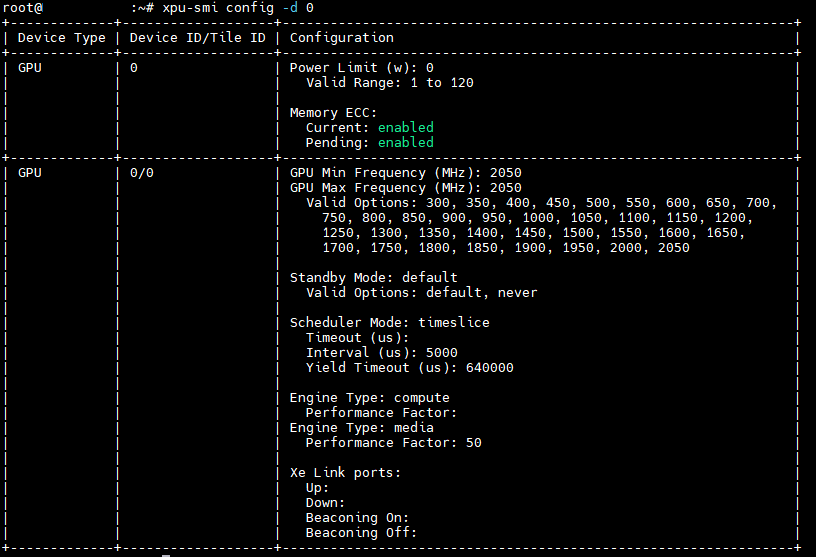

# Intel XPU Manager
Intel XPU Manager is an in-band node-level tool that provides local/remote GPU management. It is easily integrated into the cluster management solutions and cluster scheduler. GPU users may use it to manage Intel GPUs, locally. 
It supports local command line interface, local library call and remote RESFTul API interface. 

## Intel XPU Manager feature
* Provide GPU basic information, including GPU model, frequency, GPU memory capacity, firmware version
* Provide lots of GPU telemetries, including GPU utilization, performance metrics, GPU memory bandwidth, temperature
* Provide GPU health status, memory health, temperature health
* GPU diagnotics through different levels of GPU test suites
* GPU firmware update
* Get/change GPU settings, including power limit, GPU frequency, standby mode and scheduler mode
* Support K8s and can export GPU telemetries to Prometheus

## Suppored Devices
* Intel Arctic Sound-M75 GPU
* Intel Arctic Sound-M150 GPU
* Intel Arctic Sound-P GPU

## Supported OS
* Ubuntu 20.0.4
* RHEL 8.4
  

## Intel XPU Manager Architecture

  
  

## Intel XPU Manager Command Line Interface
* Show GPU basic information

  

* Show GPU settings

  
  
## GPU telemetries in Grafana exported by Intel XPU Manager

  
  
## Intel XPU Manager Installation
Please follow [XPU Manager Installation Guide](doc/Install_guide.md) to install/uninstall Itnel XPU Manager. 

### Start to use Intel XPU Manager
By default, Intel XPU Manager is installed the folder, /opt/xpum. The command line tool is /opt/xpum/bin/xpumcli. Please refer to [XPU Manager CLI User Guide](doc/CLI_user_guide.md) for how to use the command line tool. 
